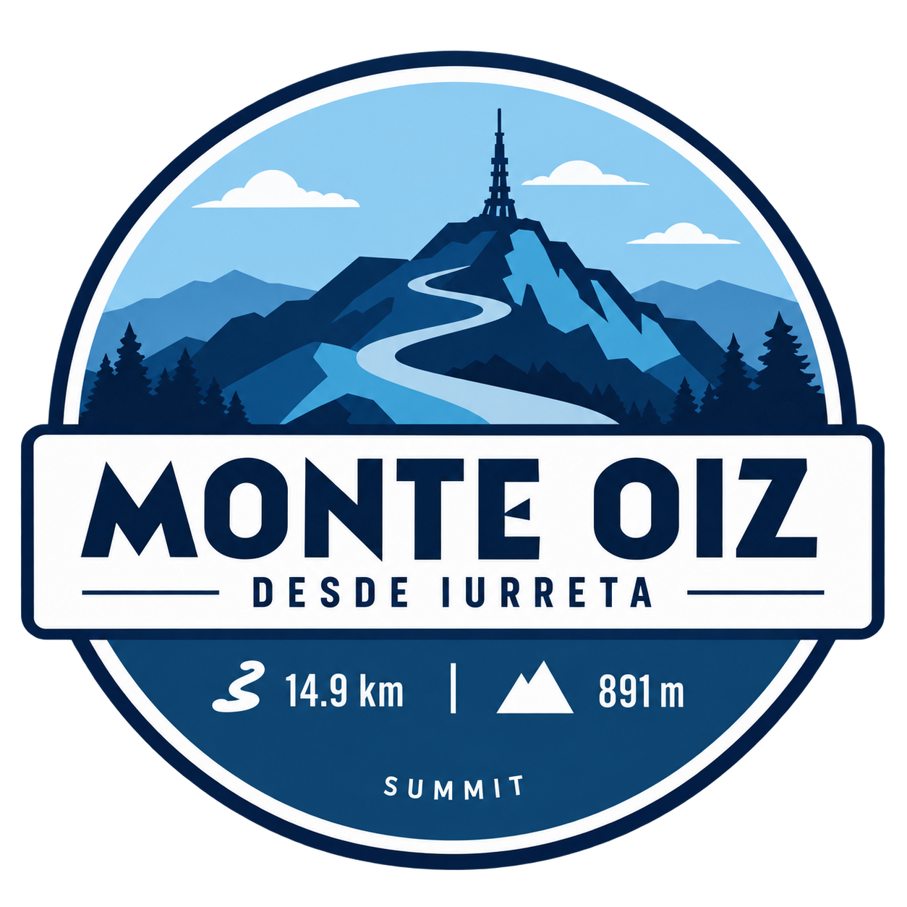

# Tarjetas de medallas con efecto flip

## 1. Objetivo del cambio

Se ha modificado la sección **Mis Parches** de SUMMIT para que cada tarjeta de un puerto pueda girarse al hacer clic.

Antes, cada tarjeta mostraba únicamente una vista fija con:

- La imagen de la chapa o medalla.
- El nombre del puerto.
- El nivel de dificultad.
- La distancia de la subida.
- El desnivel acumulado.

Ahora cada tarjeta tiene dos caras:

- **Cara frontal:** mantiene la información visual que ya existía.
- **Cara trasera:** muestra información adicional del logro, como la fecha en la que se consiguió, el tiempo empleado, la distancia y el desnivel.

El giro funciona tanto con el ratón como con el teclado.

---

## 2. Archivos modificados

El cambio se ha repartido entre dos archivos existentes:

### `src/app.js`

Se encarga de:

- Crear el HTML de cada tarjeta.
- Leer los datos de cada puerto.
- Generar la cara frontal y la cara trasera.
- Escuchar los clics y las pulsaciones de teclado.
- Añadir o quitar la clase que activa el giro.

### `src/styles.css`

Se encarga de:

- Crear el efecto visual de tarjeta en tres dimensiones.
- Ocultar la cara que queda detrás.
- Girar la tarjeta 180 grados.
- Diseñar la información de la cara trasera.
- Mantener los colores de borde correspondientes a cada nivel.
- Mostrar un indicador visual cuando la tarjeta recibe el foco del teclado.

No ha sido necesario modificar `src/index.html` porque las tarjetas se insertan dinámicamente dentro de este elemento:

```html
<div class="parches" id="parchesContainer" aria-live="polite"></div>
```

---

## 3. Cómo funcionaba antes

La función `renderParches(data)` recibía una lista de puertos y generaba una tarjeta por cada elemento.

La estructura anterior era equivalente a esta:

```html
<article class="puerto" data-nivel="1">
    <div class="puertoLogoWrap">
        
    </div>

    <div class="puertoInfo">
        <h3>Monte Oiz (desde Iurreta)</h3>
        <p class="nivelBadge">Nivel 1</p>
        <p>14.9 km · 891 m</p>
    </div>
</article>
```

Era una tarjeta plana. Aunque tenía `cursor: pointer`, todavía no tenía ninguna interacción asociada al clic.

---

## 4. Nueva estructura HTML de cada tarjeta

Cada tarjeta ahora tiene un contenedor exterior, un contenedor interior giratorio y dos caras.

La estructura general es:

```html
<article class="puerto" tabindex="0" role="button" aria-pressed="false">
    <div class="puertoCard">
        <div class="puertoCara puertoFrontal">
            <!-- Información visible inicialmente -->
        </div>

        <div class="puertoCara puertoTrasero" aria-hidden="true">
            <!-- Información adicional del logro -->
        </div>
    </div>
</article>
```

### Contenedor exterior: `.puerto`

Es la tarjeta que recibe la interacción del usuario.

Tiene estas funciones:

- Define la perspectiva 3D mediante CSS.
- Recibe el clic.
- Puede recibir el foco del teclado gracias a `tabindex="0"`.
- Se identifica como un botón mediante `role="button"`.
- Indica si está girada con `aria-pressed`.

### Contenedor interior: `.puertoCard`

Es la pieza que realmente rota.

Cuando recibe la clase `is-flipped`, se aplica esta transformación:

```css
.puerto.is-flipped .puertoCard {
    transform: rotateY(180deg);
}
```

### Caras: `.puertoCara`

Las dos caras ocupan la misma posición usando:

```css
position: absolute;
inset: 0;
```

La cara que no está visible se oculta con:

```css
backface-visibility: hidden;
```

---

## 5. Información de la cara frontal

La cara frontal conserva el diseño original de las tarjetas.

Incluye:

```html
<div class="puertoLogoWrap">
    
</div>

<div class="puertoInfo">
    <h3>${nombre}</h3>
    <p class="nivelBadge">Nivel ${nivel}</p>
    <p>${km} km · ${desnivel} m</p>
</div>
```

Los valores se obtienen del objeto de cada puerto:

- `nombre`: nombre de la subida.
- `nivel`: dificultad.
- `km`: distancia.
- `m_desnivel`: desnivel positivo.
- `logo`: nombre del archivo de la chapa, cuando existe.

Si el puerto no tiene un logo indicado, se usa la función `getPuertoLogo(nombre)` para intentar encontrar una imagen a partir del nombre.

---

## 6. Información de la cara trasera

La cara posterior muestra un resumen del logro:

```html
<div class="puertoCara puertoTrasero" aria-hidden="true">
    <span class="puertoBackKicker">Puerto conquistado</span>
    <h3>${nombre}</h3>

    <dl class="puertoDetalle">
        <div>
            <dt>Conseguido</dt>
            <dd>${fecha}</dd>
        </div>
        <div>
            <dt>Tiempo</dt>
            <dd>${tiempo}</dd>
        </div>
        <div>
            <dt>Distancia</dt>
            <dd>${km} km</dd>
        </div>
        <div>
            <dt>Desnivel</dt>
            <dd>${desnivel} m</dd>
        </div>
    </dl>

    <span class="puertoBackHint">Clica para volver</span>
</div>
```

Se ha utilizado la estructura HTML `dl`, `dt` y `dd` porque representa correctamente una lista de datos etiquetados:

- `dl`: lista de detalles.
- `dt`: etiqueta del dato.
- `dd`: valor del dato.

Esto hace que la información sea más clara semánticamente que una colección de párrafos sin relación explícita.

---

## 7. Fecha y tiempo de la subida

El JSON actual contiene el nombre, nivel, distancia y desnivel de los puertos, pero todavía no contiene los datos de cuándo se consiguió cada medalla ni el tiempo empleado.

Por eso el código busca varias propiedades posibles:

```javascript
const fecha = puerto.fecha_conseguido || puerto.fecha || "Sin registrar";
const tiempo = puerto.tiempo || puerto.tiempo_subida || "Sin registrar";
```

El operador `||` permite utilizar la primera propiedad que tenga un valor.

El orden es:

1. Buscar `fecha_conseguido`.
2. Si no existe, buscar `fecha`.
3. Si ninguna existe, mostrar `Sin registrar`.

Para el tiempo:

1. Buscar `tiempo`.
2. Si no existe, buscar `tiempo_subida`.
3. Si ninguna existe, mostrar `Sin registrar`.

Esto permite añadir datos reales más adelante sin tener que cambiar de nuevo la estructura de las tarjetas.

### Ejemplo de un puerto con datos completos

Un elemento de `data/puertosPV.json` podría quedar así:

```json
{
    "nombre": "Monte Oiz (desde Iurreta)",
    "nivel": 1,
    "km": 14.9,
    "m_desnivel": 891,
    "fecha_conseguido": "12/06/2026",
    "tiempo": "01:04:32"
}
```

En ese caso, la cara trasera mostraría:

- Conseguido: `12/06/2026`
- Tiempo: `01:04:32`
- Distancia: `14.9 km`
- Desnivel: `891 m`

Mientras esos campos no estén en el JSON, la interfaz muestra `Sin registrar` en su lugar.

---

## 8. Funcionamiento del clic

Después de crear todas las tarjetas, `renderParches` busca los elementos `.puerto` y añade un evento a cada uno.

La función central es:

```javascript
const alternarGiro = () => {
    const girada = tarjeta.classList.toggle("is-flipped");
    tarjeta.setAttribute("aria-pressed", String(girada));
    tarjeta.querySelector(".puertoTrasero")
        .setAttribute("aria-hidden", String(!girada));
};
```

### Paso a paso

1. `classList.toggle("is-flipped")` añade la clase si no existe o la elimina si ya existe.
2. El resultado se guarda en `girada`.
3. `aria-pressed` se actualiza a `true` cuando la tarjeta está girada.
4. `aria-pressed` vuelve a `false` al regresar a la cara frontal.
5. `aria-hidden` de la cara trasera se actualiza para indicar si está visible o no.

El CSS es el que convierte ese cambio de clase en una animación visual.

---

## 9. Funcionamiento con teclado

Además del clic, cada tarjeta puede activarse con el teclado:

```javascript
tarjeta.addEventListener("keydown", (event) => {
    if (event.key === "Enter" || event.key === " ") {
        event.preventDefault();
        alternarGiro();
    }
});
```

Las teclas admitidas son:

- `Enter`.
- Barra espaciadora.

`event.preventDefault()` evita que la barra espaciadora desplace toda la página cuando se usa para girar la tarjeta.

La combinación de `tabindex="0"`, `role="button"` y los eventos de teclado permite que el componente sea utilizable sin ratón.

---

## 10. Efecto 3D en CSS

El efecto se construye con cuatro propiedades principales.

### Perspectiva

```css
.puerto {
    perspective: 1000px;
}
```

La perspectiva define cómo se percibe la profundidad durante el giro.

### Conservación del espacio 3D

```css
.puertoCard {
    transform-style: preserve-3d;
}
```

Permite que las dos caras mantengan su posición tridimensional.

### Rotación

```css
.puerto.is-flipped .puertoCard {
    transform: rotateY(180deg);
}
```

Gira el contenedor interior sobre su eje vertical.

### Ocultación de la cara posterior

```css
.puertoCara {
    backface-visibility: hidden;
}
```

Evita que el contenido se lea al revés durante la rotación o cuando está detrás.

La animación dura `500ms`:

```css
transition: transform 500ms ease, box-shadow 180ms ease;
```

---

## 11. Diseño de la cara trasera

La cara trasera utiliza el verde oscuro principal de SUMMIT:

```css
background: var(--color-forest);
color: var(--color-snow);
```

La información se organiza en una cuadrícula de dos columnas:

```css
.puertoDetalle {
    display: grid;
    grid-template-columns: repeat(2, 1fr);
}
```

De esta forma los cuatro datos se distribuyen en dos filas:

```text
Conseguido       Tiempo
Distancia        Desnivel
```

Las etiquetas se muestran en un tamaño más pequeño y los valores utilizan la fuente monoespaciada configurada en el proyecto para que los tiempos sean fáciles de comparar visualmente.

---

## 12. Bordes por nivel

Antes el borde de nivel se aplicaba directamente a `.puerto`.

Como ahora el contenedor exterior se utiliza para la perspectiva y la rotación, el borde visible debe estar en las caras reales de la tarjeta.

Por eso las reglas ahora apuntan a `.puertoCara`:

```css
.puerto[data-nivel="1"] .puertoCara {
    border-top: 4px solid var(--level-1);
}
```

Se aplica el mismo patrón a los niveles 2, 3 y 4.

Así el color de dificultad sigue siendo visible tanto en la cara frontal como en la trasera.

---

## 13. Estado de foco

Cuando una tarjeta se selecciona con el teclado, aparece un contorno ocre:

```css
.puerto:focus-visible {
    outline: 3px solid var(--color-ochre);
    outline-offset: 4px;
    border-radius: 28px;
}
```

`focus-visible` hace que el contorno se muestre especialmente cuando la navegación se realiza con teclado, sin añadir ruido visual innecesario al clic normal.

---

## 14. Compatibilidad con los filtros

Los filtros por nivel no se han cambiado.

Cuando se pulsa uno de los botones de nivel:

1. Se filtra `todosLosPuertos`.
2. Se vuelve a llamar a `renderParches`.
3. Se destruyen las tarjetas antiguas.
4. Se crean las tarjetas del nuevo resultado.
5. A cada tarjeta nueva se le vuelven a asociar sus eventos de clic y teclado.

Por eso el giro también funciona después de filtrar por cualquier nivel.

---

## 15. Validaciones realizadas

Se han realizado estas comprobaciones:

### Sintaxis de JavaScript

Se ejecutó:

```bash
node --check src/app.js
```

Resultado: el archivo tiene una sintaxis válida.

### Diagnósticos del editor

Se revisaron:

- `src/app.js`
- `src/styles.css`

Resultado: no se encontraron errores.

### Formato del diff

Se ejecutó:

```bash
git diff --check
```

Resultado: no se encontraron espacios problemáticos ni errores básicos de formato.

---

## 16. Resumen final

El cambio convierte las tarjetas de medallas en componentes interactivos con dos estados:

```text
Cara frontal -> clic o teclado -> cara trasera
Cara trasera -> clic o teclado -> cara frontal
```

La implementación mantiene el diseño existente, reutiliza las variables de color y tipografía del proyecto, conserva los filtros por nivel y deja preparada la interfaz para mostrar fechas y tiempos reales cuando esos datos se añadan al JSON.
